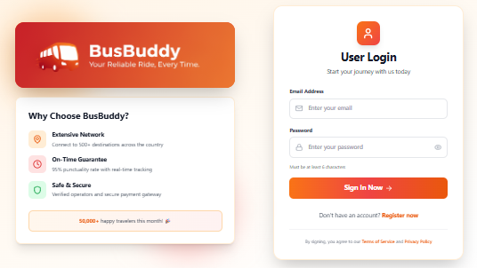
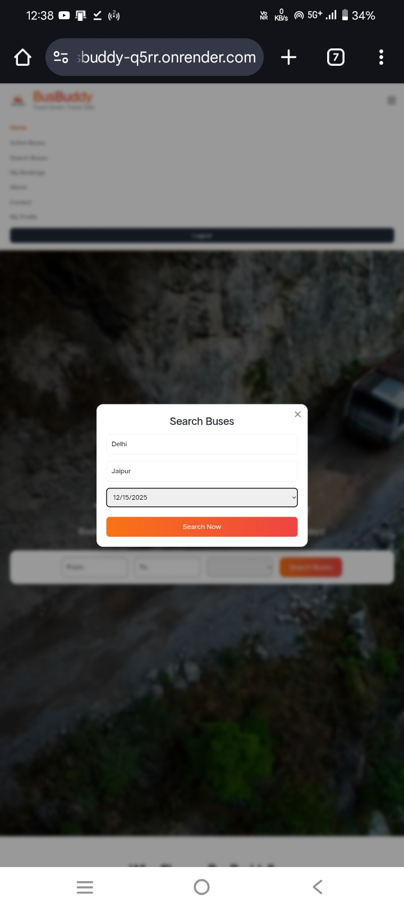
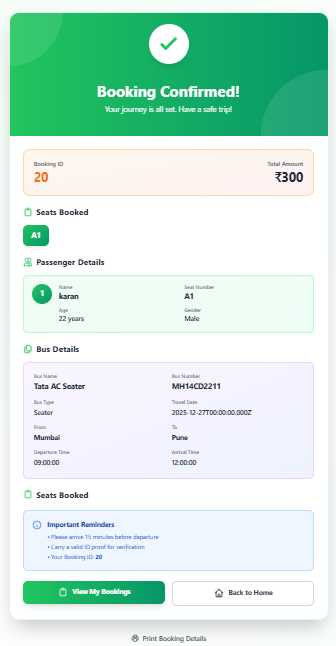
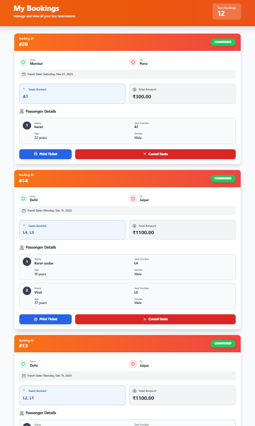
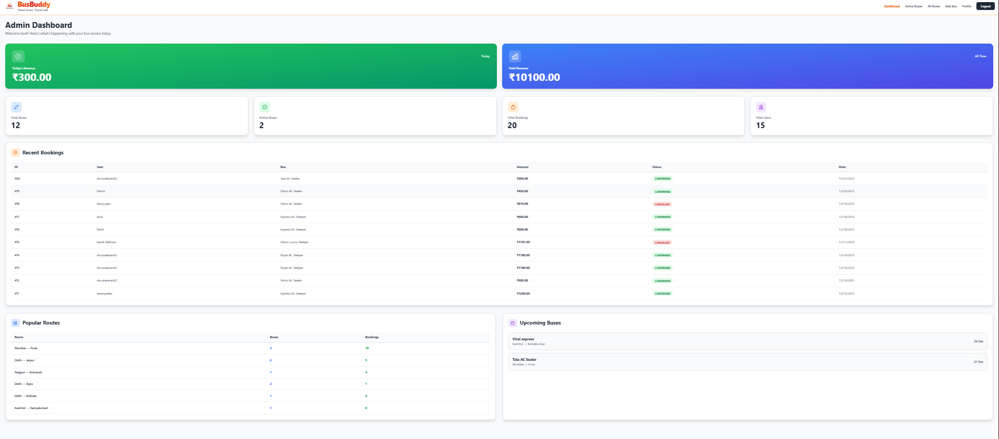
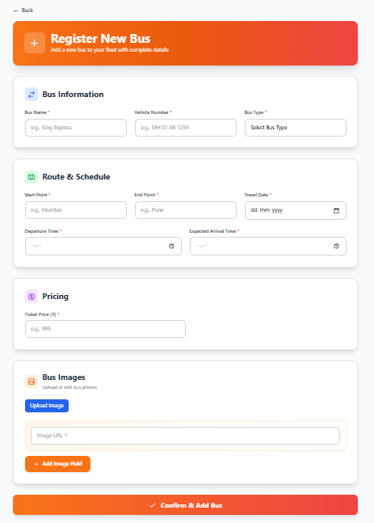
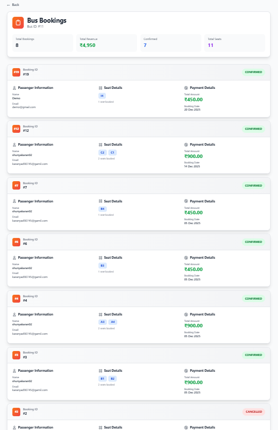

🚌 BusBuddy – Online Bus Ticket Booking System

BusBuddy is a production-ready full-stack online bus ticket booking system
with real-time seat selection, secure authentication, and admin management.

🔗 Live Demo
https://busbuddy-frontend.onrender.com

📸 Screenshots

### User Flow

**Login / Signup**

**Search Buses**

**Seat Selection**

**Booking Success**

**My Bookings**

---

### Admin Panel

**Admin Dashboard**

**Add / Update Bus**

**View Bookings**

🚀 Features

👤 User Features

User authentication (Signup / Login)
Search buses by route & date
View seat layout (Sleeper / Seater)
Select seats & add passenger details
Book tickets securely
View booking history
Download / Print ticket (PDF)
Cancel selected seats or full booking
Profile dashboard with stats

🛠 Admin Features

Admin authentication
Add / Update / Delete buses
Upload bus images (Cloudinary)
Manage seat layouts
View bookings per bus
View popular routes
Dashboard analytics

🧑‍💻 Tech Stack

Frontend
React (Vite)
React Router
Tailwind CSS
Axios
Cloudinary (Image Upload)

Backend

Node.js
Express.js
MySQL (Railway)
JWT Authentication
Multer + Cloudinary
REST APIs

Deployment

Frontend: Render (Static Site)
Backend: Render (Web Service)
Database: Railway MySQL
Images: Cloudinary

Security

JWT-based authentication
Role-based access (Admin / User)
CORS protected APIs
Environment variables for secrets
Role-based protected routes

⚙️ Local Setup

1. Clone the repository

git clone https://github.com/Shunya-karan/ticket-booking-system.git

2. Install dependencies

Frontend:
cd frontend
npm install
npm run dev

Backend:
cd backend
npm install
npm run start

3. Configure environment variables using .env.example

🔑 Demo Credentials

Admin
Email: admin@example.com  
Password: admin123  

User
Email: user@example.com  
Password: user123

🔮 Future Enhancements

- Online payment gateway integration
- Email / SMS ticket notifications
- Advanced seat pricing

⭐ Support

If you like this project, please give it a ⭐ on GitHub!

📌 Note

This project was deployed using Railway and Render during development.
The deployment may become inactive due to free-tier limitations,
but the application is fully production-ready and cloud-deployment compatible.
